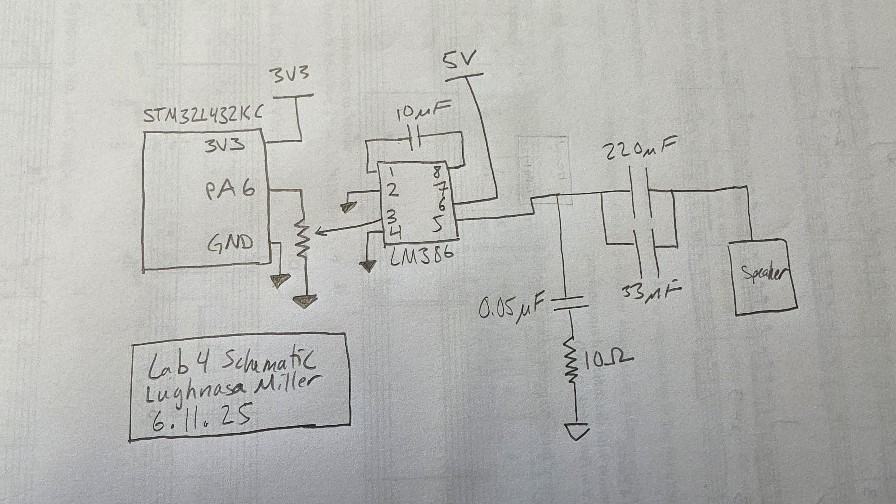
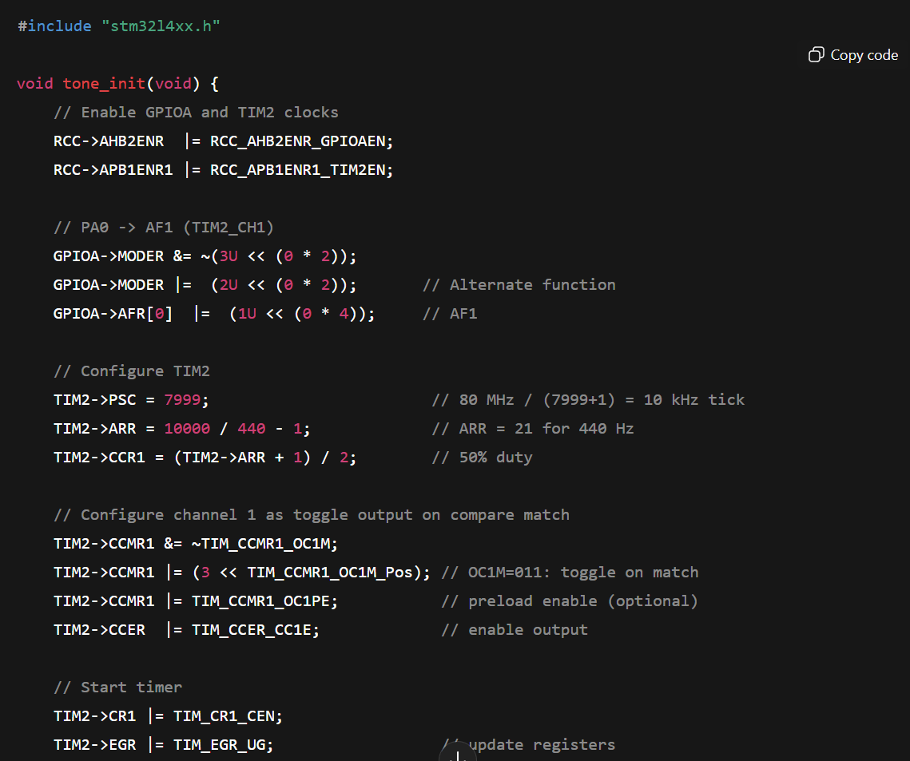

# HMC E155 Lab 4: Digital Audio

## Introduction

In this lab, the timers and a GPIO pin on the STM32L432KC microprocessor was used to control a speaker and play songs using C code. Drivers were created to control both a PWM and a delay counter, and a main function was written to combine the two timers and play audio.

## Timer Calculations

When using the counter in the lab to both control a PWM for the speaker and a timer for note duration, multiple calculations had to be made to ensure calculations were within 1% of specification. Selecting a prescaler value of 16, we need to make sure that we will not overflow our autoreload register with whatever value we must enter. This is determined with the formula $ARR = \frac{f_{sysclk}}{PSC * f_{target}}$. For 220 Hz, this gives us an $ARR$ value of approx 22,727 and a value of approx 5,000 for 1000 Hz. Plugging these values in to determine the specific frequency we will output, this gives us a value of $f_{actual} = 1000$ when $ARR = 5000$ and a value of $f_{actual} = 220.002$ when $ARR = 22,727$.

For the timer, we used a prescaler (clock divider) value of $clk_{system} / 1000$, meaning each clk on the timer was 1 ms. This means that the range of values for our duration timer is anywhere from 1 to 65535 ms, or .001 to 65.535 s.

## Schematic

The below schematic shows how this circuit was constructed. Our PWM signal from pin PA6 was fed through a potentiometer and into the LM386 amplifier. This current was run through two capacitors in parallel to create a capacitance of ~250 $\mu F$ before being fed into the speaker. Decoupling was used as necessary to clean sound.

 
*Figure 1: Schematic for speaker circuit with amplifier and potentiometer*

## Results and Discussion

Upon running (or resetting) the MCU, the speaker successfully played Fur Elise or played the guitar intro from American Teenager by Ethel Cain. There was no distortion to the sound due to hardware overflows, and the songs played as written (in C arrays).

## Conclusion

In this lab, I created a set of MCU drivers that appropriately enable system clocks, counters, and a GPIO pin to send a timed-duration PWM signal to a speaker on a breakout board. The system successfully played both Fur Elise by Ludwig van Beethoven and American Teenager by Ethel Cain. Overall, this lab took me 20 hours.

## AI Prototype

Following the directions for the AI Prototype for lab 4, the following prompt was passed into ChatGPT:

*What timers should I use on the STM32L432KC to generate frequencies ranging from 220Hz to 1kHz? What’s the best choice of timer if I want to easily connect it to a GPIO pin? What formulae are relevant, and what registers need to be set to configure them properly?*

The model correctly displayed information on the various timers on our STM32L432KC, and then selected TIM2 as the timer we should use. It even wrote code (that seems reasonable at a glance) to generate an A4 on a speaker. This was a useful tool to learn something, but I would definitely want to know neough about it to fact check the AI before I trusted this, and I don't think people using it would be able to discern the difference.

*Figure 8: Code for the oscillator written by ChatGPT*
