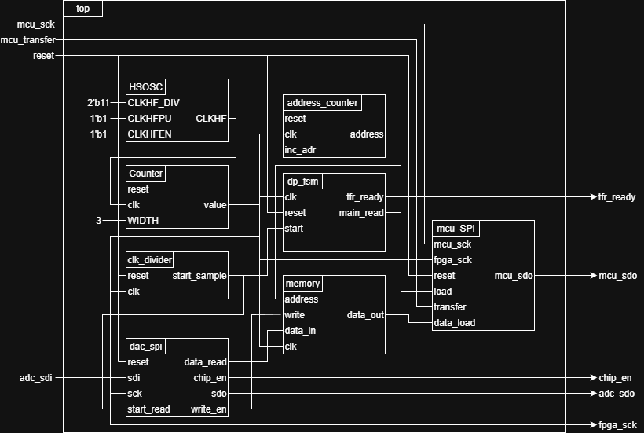
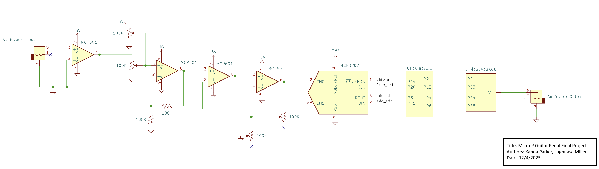
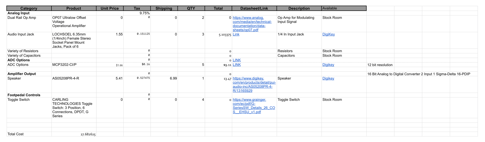
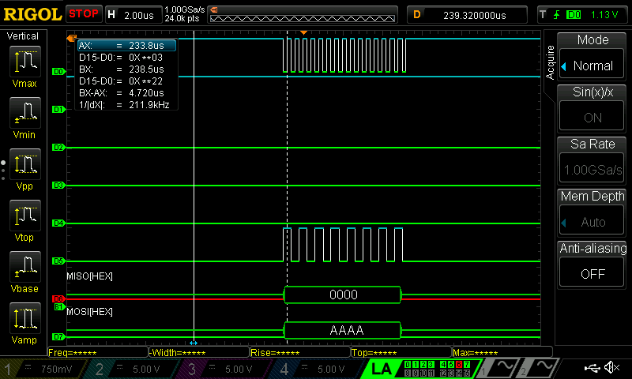
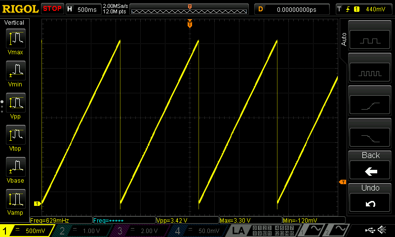
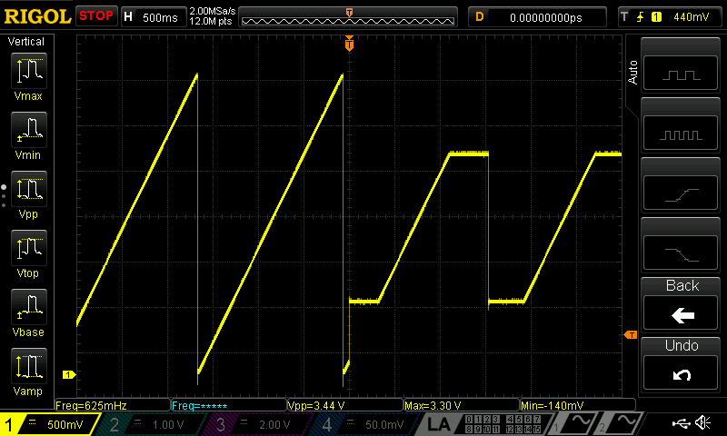

# E155 Final Report: Multi-Effect Guitar Pedal

## Description

Our final project was to design and build a digital guitar amplifier capable of producing 4 audio effects: distortion, reverb, vibrato, and chorus. Using an iCE 40UP5K FPGA and an MCP3202 ADC, we sample our guitar output and perform all effects related to time-delay. An STM32L432KC microcontroller performs all modifications that change the amplitude of our signal in a non-linear way as well as converting our digital signal back to an analog one before recentering and playing our signal.

## Biographies

### Lughnasa Miller

Lughnasa Miller is a senior Computer Science major at Harvey Mudd College. She focuses her studies in computer science at the system level, learning about the interaction between low level code and system components and creating embedded systems to solve problems. Outside of the classroom, you can find her playing one of the seven instruments she has learned or organizing queer community through the PRISM club and other engagements. Lughnasa can be found on [GitHub](https://github.com/lughnasam) as well as [LinkedIn](https://www.linkedin.com/in/lughnasamiller/).

### Kanoa Parker

Kanoa is a Senior at Harvey Mudd College, born and raised in Los Angeles, CA. His passions are in Automotive Engineering, and 3D Design. Currently, he is an active member of Claremont College's Men's Rugby Team. In his leisure time, he enjoys hiking, camping, vegetarian cooking, and pursuing creative endeavors in wood carving and model building. Kanoa can be found on [GitHub](https://github.com/kanparker) as well as [LinkedIn](https://www.linkedin.com/in/kanoa-parker/).

## FPGA Design Information

The FPGA aimed to communicate with an ADC over a serial communication protocol, enabling it to read in a 12-bit serial analog signal. This information will be stored in the FPGA memory blocks before being read out at various times to implement delay based effects in our sound.

Two main halves of this system were ideated and implemented: a controller SPI communication module for interfacing with the ADC chip purchased for this project, as well as a memory for storing samples and loading into a shift register that interfaced with our STM32L432KC processor as a peripheral to the MCU's SPI communications. The full details of the digital design can be interpreted in the block diagram shown below.

*Figure 1: Block diagram of the FPGA implementation*

The ADC SPI module implemented a shift register to record input from the ADC and utilized an FSM that controlled the FPGA's SDO bit as well as asserting signals to the memory when a sample was ready to be stored. The datapath contained an FSM that controlled when memory was read and the current address in memory was implemented, and there was a specially designed shift register that functioned on either the FPGA or MCU clock in order to both load and empty the register.

## MCU Design Information

In this project, the MCU will take data over SPI communications from the FPGA. After this, the MCU will determine whether a distortion and/or vibrato effect should be applied to the signal. It will apply the relevant transformations, and then it will use the onboard DAC to convert back to an analog signal before outputting to a $\frac{1}{4}$ in. audio jack which drives a small guitar amp.

## New Digital Chip: Microchip MCP3202 ADC

In this project, we aimed to implement an ADC that was interfaced with by the FPGA. This allowed us to use the MCU's onboard DAC to complete a full datapath and enabled us to not circle back, having to send signals back and forth between the MCU and FPGA. This challenged us in a number of ways, including designing an FSM on the FPGA capable of sending the proper initiation bits to read a signal as well as learning how to synchronize this design with the rest of our datapath.

## Electrical Schematic

Below is the surrounding electrical schematic. On the rx chain, filtering was implemented to clean out signal before moving it from an ~ 100 mVAC signal to a 0-3.3 VDC signal that is acceptable for digital interfacing. At the other end of the system, after the MCU's DAC, these operations were inverted so our signal once again mimicked that of a standard guitar. Below, a schematic of our electrical system can be seen.

*Figure 2: Full surrounding electrical schematic for signal voltage adjustment*

## Bill of Materials

Below is a figure detailing the bill of materials used in this project.

*Figure 3: Bill of materials detailing materials aquired for use in this project*

### Results

In our project, we were unable to achieve the goals we had set for our FPGA design. A major roadblock for us was interfacing the ADC with the FPGA. This error was very confusing with us, as communication over SPI was intermmittent and unstable, but did work occasionally. Too late in our project, we realized that the sampling rate that we wanted to achieve with our FPGA architecture was not compatible with the ADC we had purchased. As a result, we had to modify our clock tree and sampling rate previously designed.

Another major roadblock we navigated was loading the shift register for the MCU to read samples from the FPGA. This happened because the FPGA ran on its own clock domain, and the MCU ran its SPI transactions on a separate clock that ran approximately 500 MHz faster than that on the FPGA. However, this roadbock was successfully navigated and can be seen in the following section.

The MCU systems we aimed to implement worked well on their own. The first major piece of our design was the SPI communications between the MCU and the FPGA. By looking at the digital trace of these communications below, we can see that the MCU successfully retrieved a sample from the FPGA. 

*Figure 4: FPGA to MCU SPI transaction*

The next step was for the MCU to use the onboard DAC to process a clean signal and send it through our postprocessing chain. This was done in the image seen below using a sample frequency, indicating that we were capable of outputting a known voltage.

*Figure 5: Clean MCU output wave trace*

Finally, we implemented the distortion effect, which functions by clipping the edges of our signal range to make our audio waves more square. This gives the audio a distorted effect, which can be seen in songs as early as *Voodoo Child (Slight Return)* by Jimi Hendrix. Below is an oscilloscope trace conveying a working distortion signal using sample data.

*Figure 6: MCU output wave trace with distortion*

## Reflection

Overall, our team learned a lot in the experience of completing the project, even if we did not achieve the final goal of creating a functional guitar pedal. We definitely undersold ourselves on the amount of time we would need to complete our project, and it ended up being the nail in the coffin for our group. However, we did learn valuable lessons in reading our datasheets and learning specific SPI protocols. We also gained valuable experience in designing clock domains with synchrony across multiple clocks, which was a difficult but valuable achievement for us in the later stages of our project. 

We also think that the architecture for our project was very solid, and the various components for the project were ones we feel were right for the job. Given a few more days, we believe we could have bugfixed the commnunications between the ADC and FPGA, which would have processed a clean sample for us. Following this, we would have been able to complete modifications to the FPGA datapath that would have allowed averaging of past samples to enable reverb and chorus effects. Finally, enabling the RNG peripheral on the MCU would have given us a method for implementing the vibrato effect on the signal, completing our fourth and final effect, and the total goal for our project.

## Acknowledgements

We want to thank Prof. Spencer, Javier, and the E155 grutoring team for their guidance and advice as we went along the path of this project. We also want to thank engineering staff as a whole for their support, especially in the final push of the project and in aquiring the materials necessary to complete the project.

## References

[STM32L432KC Documentation and Reference Manual](https://www.st.com/en/microcontrollers-microprocessors/stm32l432kc.html#documentation)

[ICE40UP5K Family Datasheet](https://hmc-e155.github.io/assets/doc/FPGA-DS-02008-2-0-iCE40-UltraPlus-Family-Data-Sheet.pdf)

[Microchip MCP3202 ADC Documentation](https://www.microchip.com/en-us/product/mcp3202#Documentation)

[GitHub Project Repository](https://github.com/lughnasam/e155_project)